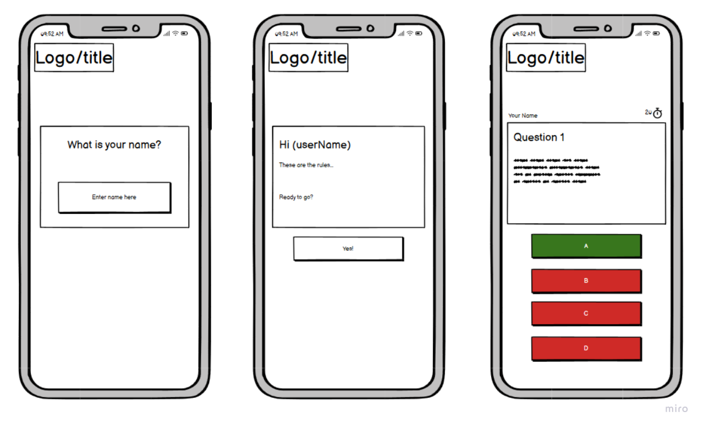
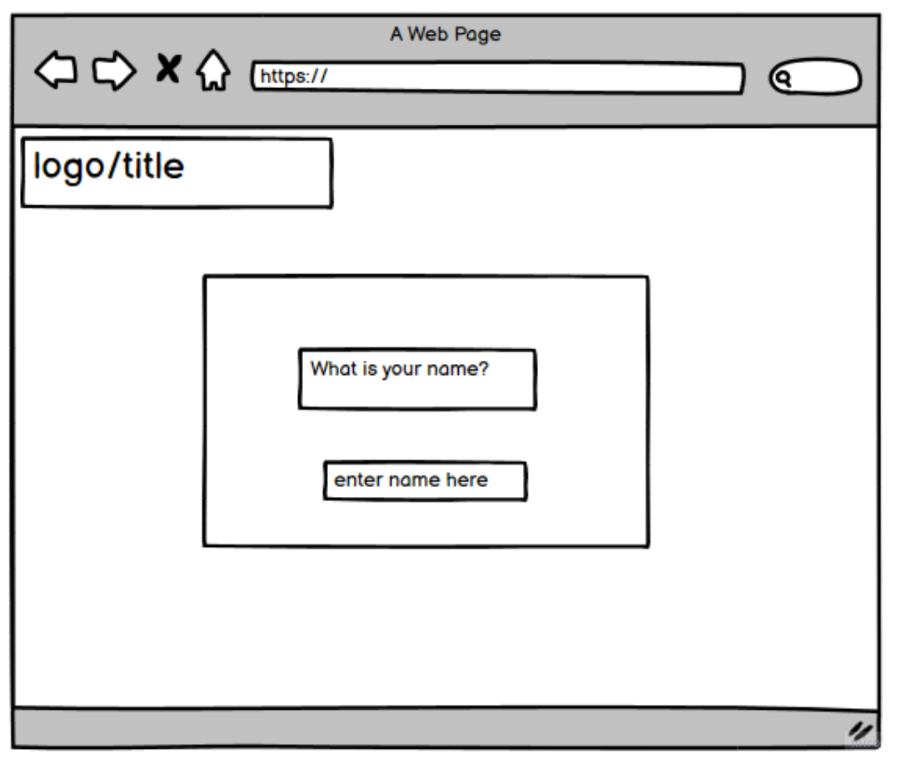
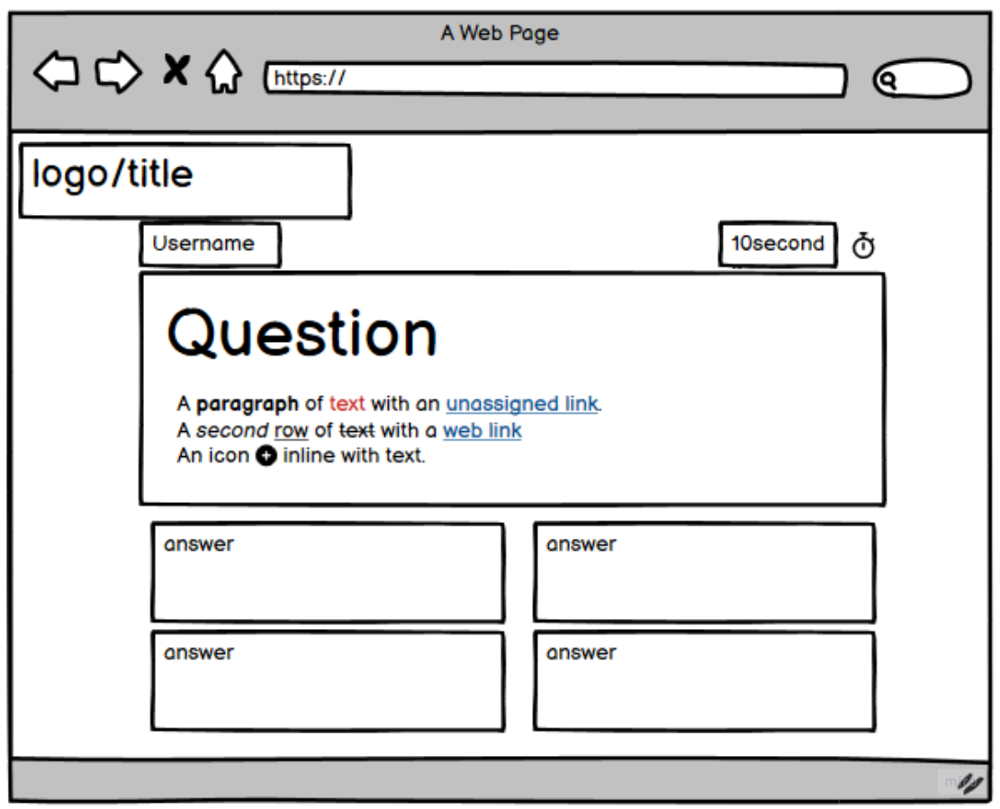
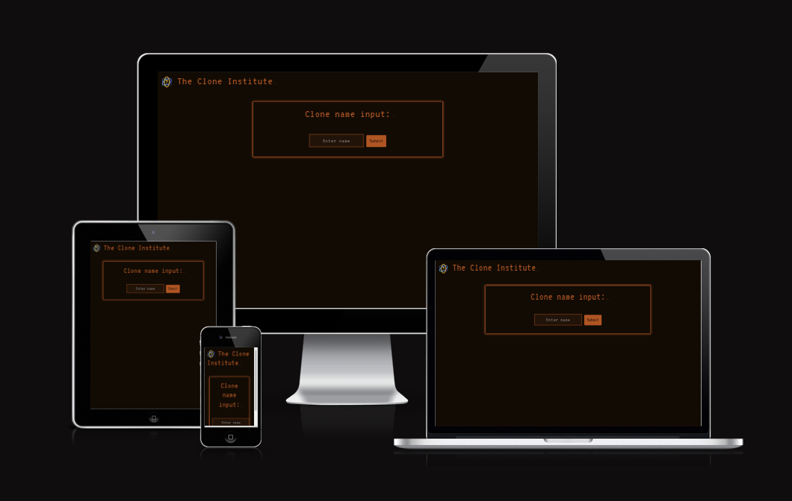
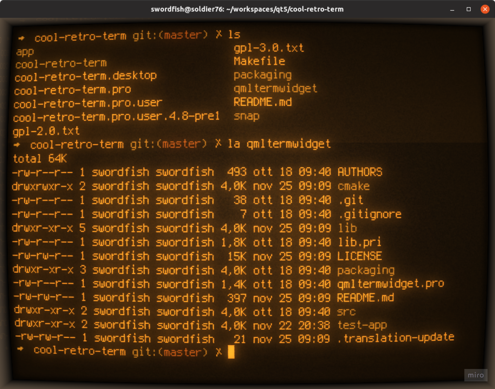

# Clone Institute

## Overview

### Purpose
The goal of this project is to deliver an engaging quiz experience for online users. The quiz is framed within a narrative for added interest, with a design that complements the storytelling while maintaining a clean, user-friendly layout for easy navigation. This front-end development is fully responsive to provide an enjoyable browsing experience across all devices, with its structure, functionality, and styling created using HTML, CSS, and JavaScript. 
  

### Target Audience

The target audience for a clone story quiz game could include:

Sci-Fi Enthusiasts: Fans of science fiction who enjoy themes like cloning and futuristic technology

Gamers: People who enjoy interactive, story-driven games with quizzes or puzzle elements.

Quiz Lovers: Players who enjoy testing their knowledge through quizzes, particularly those with a unique, immersive narrative element.

Fans of Dystopian or Futuristic Narratives: Those who are into dystopian themes and enjoy engaging with these type of worlds and alternate realities.

Casual Players: Users looking for short, engaging quizzes with a twist in the form of storytelling elements.

Creative Story Lovers: People who appreciate narrative-driven experiences and enjoy branching storylines or "choose your own adventure" formats.

This audience values creativity, problem-solving, and immersive storytelling in a futuristic or speculative setting.
 

## User Stories

### Must-Have User Stories
- **User Story 1:** As a user I can see a countdown of how many seconds are left so that I know how long I have left to answer questions.  
  **Acceptance Criteria:** Create a working timer function that is visible to the user that counts down in seconds.

- **User Story 2:** As a user I can make a username so that my username provides a layer of interaction.  
  **Acceptance Criteria:** Create a username input field, with username validation and a clear error message, a submit button and a persistant username display so the name remains visible throughout the quiz and the game can refer to the user by name. 

 - **User Story 3:** As a user I can click on a button with an answer so that I can answer the given question. 
 **Acceptance Criteria:** Create clearly visible answer options presented as clickable buttons, the buttons adjust layout depending on screen size for usability.
- **User Story 4:** As a user I can provide feedback so that I may report any issues with the website. 
  **Acceptance Criteria:** Create a feedback form for users to comment on their experience, make the design in keeping with the rest of the layout.

- **User Story 5:** As a user I can choose from some predetermined answers so that I can answer the question. 
  **Acceptance Criteria:** Create multiple choice questions displaying each answer option in a clearly labelled button, the user can select only one answer, there is immediate feedback indicating whether the answer is correct or not.

- **User Story 6:** As a user I can easily navigate the website so that I am more likely to revisit and interact more. 
  **Acceptance Criteria:** Create a clear consistent layout with visual cues such as colour changes and text instructions for the user.

 - **User Story 7:** As a user I can see whether my answer is correct so that I can have instant feedback on my question before moving onto the next. 
  **Acceptance Criteria:** Provide answer feedback for the user with a colour coded right or wrong response on the answer buttons.

  - **User Story 8:** As a user I can get points for getting an answer correct so that I get a reward for being correct. 
  **Acceptance Criteria:** Create a clear points system with immediate feedback and a points display.

  - **User Story 9:** As a user I can read how to play the game so that I know how to play the game. 
  **Acceptance Criteria:** Make sure the game is explained enough for a new player in a succinct way in keeping with the overall theme of the game.

  - **User Story 10:** As a user I can see my current score so that I know how many correct answers I have 
  **Acceptance Criteria:** Create a scoreboard that displays the users points and updates as the game progresses.

 
### Should-Have User Stories
- **User Story 11:** As a user I can see a button change colour when I hover over it so that it is more obviously an interactive page element.  
  **Acceptance Criteria:** Create a visual cue for buttons so that they provide clear feedback to the user that these elements are interactive..

 - **User Story 12:** As a user I can hear sound effects when I answer so that I have increased immersion in the quiz 
 **Acceptance Criteria:** Create sound effects to enhance the game play and add another sensory element to the game.

  - **User Story 13:** As a user I can engage in the story of the quiz so that I have more fun playing the quiz.  
  **Acceptance Criteria:** Create a narrative framing device to add more interest to the game and give the whole thing more of a distinctive atmosphere.

  

### Could-Have User Stories
- **User Story 14:** As a user I can skip a question so that if I don't know the answer I can strategically use my time. 
  **Acceptance Criteria:** This would allow the user to skip a question if they found it too difficult, this may not fit in with the theme of the game.

- **User Story 15:** As a user I can choose the difficulty of the quiz so that I can decide on how tough the questions are to answer  
  **Acceptance Criteria:** Again perhaps this isn't right for the theme, the questions will be set for the user.
- **User Story 16:** As a user I can select the quiz subject so that I can play my preferred subject (e.g. geography)  
  **Acceptance Criteria:** As with choosing the difficulty of the questions the user choosing their own subject probably won't be right for this project.

- **User Story 17:** As a user I can hear music when playing the game so that I have increased enjoyment when playing 
  **Acceptance Criteria:** Add theme appropriate music to enhance the atmosphere of the game, perhaps with mute function so that the user can choose whether to have the music or not.

## Design Decisions

### Wireframes

A simple layout, which is designed to be easily navigable and responsive.

## Narrative Framing Device

As part of the ideation process we decided we wanted a strong visual theme this evolved into the narrative part of the game. 

## Colour Scheme:

We used the following colours to create the vintage feel of the game:

FFA328 - Orange Peel
B05417 - Burnt Orange
120B04 - Smoky Black

## Fonts:

The font VT323 was selected in keeping with the theme of the game and to add atmosphere.

### Accessibility Considerations

We added colour contrasting text and backgrounds and alt text for images.

## Features Implementation

### Core Features (Must-Haves)
- **Feature 1:** Timer : There is a countdown from 60 seconds with a clock icon next to it.
- **Feature 2:** Username: The username displays above the question being asked.
- **Feature 3:** Answer buttons: These are responsive and displayed beneath the question.
- **Feature 4:** Feedback form: There is a link to the form and the form is styled to match the rest of the game.
- **Feature 5:** Multiple choice questions: These are sourced from an API.  
- **Feature 6:** Strong visual theme: This is displayed in the design choices for the text and colour scheme and the surrounding story helps create the required atmosphere.
- **Feature 7:** Answer feedback: The responsive buttons change colour according to which answer is correct.
- **Feature 8:** Points system: The points system is connected to the question responses and is displayed on the scoreboard.
- **Feature 9:** How to play: The rules are explained to the user within the game.

### Advanced Features (Should-Haves)
- **Feature 1:** Button interactivity: The buttons respond to hovering over and clicking on.
- **Feature 2:** Music: Sourced music with a 'spooky eighties vibe'.
- **Feature 3:** Narrative framing device: The story about the clone was added to the beginning of the game once a working quiz had been created.

## Testing and Validation

### Testing Results
Summarize the results of testing across different devices and screen sizes.  
Mention any issues found and how they were resolved.  
**Guidance:** Summarize the results of your testing across various devices using tools like Chrome DevTools, as outlined in Phase 2. Mention any issues found and how they were resolved.

### Validation
Discuss the validation process for HTML and CSS using W3C and Jigsaw validators.  
Include the results of the validation process.  
**Guidance:** Document your use of W3C and Jigsaw validators to ensure your HTML and CSS meet web standards. Include any errors or warnings encountered and how they were resolved.

## Deployment

### Deployment Process

### GitHub Pages

The site was deployed using GitHub pages, from the main branch.

<a href=https://oliver-tommy.github.io/hackathon-1/>Link to the site</a>

## Development Process

We used an Agile methodology for planning and designing the game. We created a miro board in the first round of ideation and then had a project board for the user stories which we assigned labels of 'must have', 'should have' and 'could have' depending on perceived importance. We used Git and Github for version control, each having our own branch to work on and then combining our work through git commands and requests.

## Code Attribution and other references

## Logo

The logo was sourced from <a href=https://www.flaticon.com/>Flaticon.com</a>

## Wireframes

The wireframes were made using Balsamiq <a href=https://www.balsamiq.com/>Balsamiq.com</a>

## Colours

There was a reference image:

The exact colour values were obtained from <a href=https://coolors.co/>Coolors.co</a>

## Icons

<a href=https://fontawesome.com/icons>fontawesome.com</a> was used to provide the clock icon.

## Make your own adventure game code ideas

Link to youtube video: https://www.youtube.com/watch?v=R1S_NhKkvGA 

## Images

The images were designed using <a href=https://www.canva.com/>Canva.com</a>

## Clone Institute Logo

The Clone Institute logo was made using <a href=https://www.logoai.com/make>logoai.com</a>

## AI Tools Usage

<a href=https://chatgpt.com/>ChatGPT</a> generated the code that formatted our API data into questions.

## Other sources

<a href=https://stackoverflow.com/>stackoverflow.com</a> was used to find answers to various questions. 

<a href=https://ui.dev/amiresponsive?url>Am I responsive?</a> was used to create the screenshot of our game on various devices.

The music was Aura by Alex-Productions  https://onsound.eu/
Music promoted by <a href=https://www.free-stock-music.com/>freestockmusic.com</a>
Creative Commons / Attribution 3.0 Unported License (CC BY 3.0)
https://creativecommons.org/licenses/by/3.0/deed.en_US 

## Future Improvements

A potential future improvement could be that once you've gone through the questions a few times it might be nice to have an option to get back to the game walkthrough and start it from the beginning again. Another idea for the future could be to add more storytelling and perhaps different levels, perhaps getting more difficult questions as you go along, before getting cast into oblivion if you fail.
